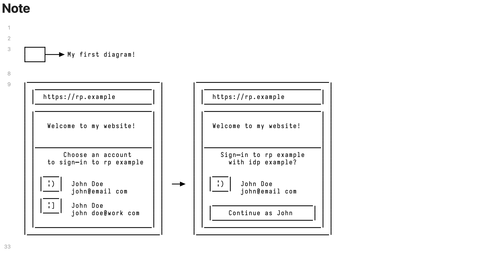

# Obsidian Google Typograms

## Overview


## Usage

<pre>
```typograms
+----+
|    |---> My first diagram!
+----+
```
</pre>

More examples here:
https://google.github.io/typograms/

## Instalation

### Clone 
Clone the repository into `plugins` folder:

```sh
$ cd <vault folder>/.obsidian/plugins
$ git clone https://github.com/lucaskatayama/obsidian-google-typograms
```

### Reload Obsidian

`cmd/ctrl + p`

Reload without saving

